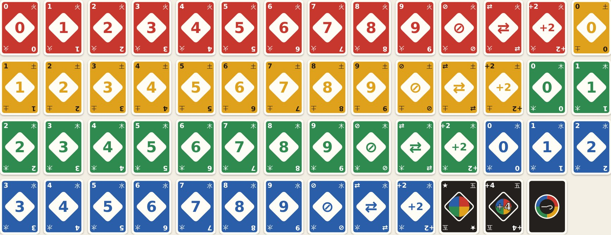

<h1 align="center">Hitotsu <sub>一つ</sub></h1>

<p align="center"><strong>The colour-card game, with the house rules people actually play.</strong><br>
Match the colour or the number, and call Hitotsu! with one card left. Two to eight players, a computer for any seat, a table for several devices, and a deck of its own.</p>

<p align="center">
  <a href="https://github.com/johnmorrisdotca/hitotsu/actions/workflows/ci.yml"></a>
  <a href="https://www.npmjs.com/package/@johnmorrisdotca/hitotsu"></a>
  <a href="./LICENSE"></a>
  
  
</p>

<p align="center"><a href="https://johnmorrisdotca.github.io/hitotsu/"><strong>Play a hand →</strong></a> · <a href="https://johnmorrisdotca.github.io/hitotsu/api.html">API reference</a></p>

<p align="center">
  
  
</p>

*Hitotsu* means "one" in Japanese: the call a player makes with one card
left. It began as the colour-card game on [Itsutsu](https://itsutsu.com/games/hitotsu),
a site for board and table games, which uses this package for its rules, its
computer player, its tables on several devices and its cards.

## In 30 seconds

```sh
npm install @johnmorrisdotca/hitotsu    # or pnpm add, or yarn add
```

```ts
import { HITOTSU_PARTY, mountHitotsu } from "@johnmorrisdotca/hitotsu";

mountHitotsu(document.getElementById("table")!, { rules: HITOTSU_PARTY });
```

That is a whole table: you and three computers, with the party rules. Or with
no script of your own:

```html
<script type="module" src="https://cdn.jsdelivr.net/npm/@johnmorrisdotca/hitotsu@1/dist/element-define.js"></script>
<hitotsu-table rules="party" computers="3"></hitotsu-table>
```

## Who it is for

- **Anybody putting a card game on a page.** The rules, the deal, the turn
  order, the scoring and a computer player are done, and so is a table to play
  it at. You can take all of it, or only the rules and draw your own.
- **Games sites and apps.** A table for several devices checks what arrives
  over the wire, and a saved game cannot hold a position the rules would not
  reach.
- **Bots and research.** Pure functions over plain data: play a thousand games
  in a loop, and replay any one from its seed.
- **Teaching.** The rules are a few hundred lines you can read, with their
  tests beside them.

## Features

- **The familiar game.** Numbers in four colours, Skip, Reverse, Draw Two,
  Wild and Wild Draw Four; the call with one card left, and two cards for
  forgetting it. Scored by the cards left in the other hands, to 200 or 500
  points, or a single hand.
- **The house rules, as options.** Stacking draw cards (the same card, or any
  on any), jump-in, sevens and zeros, draw until you can play, and the Wild
  Draw Four challenged or played without bluffing. `HITOTSU_CLASSIC` and
  `HITOTSU_PARTY` are ready-made; mix your own.
- **Pure and replayable.** Every function takes a game and returns a new one.
  A game is its set-up, a seed and its moves, kept as one line of text and read
  back by playing the moves again through the rules, so a saved game can never
  hold a position the rules would not reach.
- **A computer player** that stacks rather than takes, challenges a big hand's
  Wild Draw Four, saves its wilds, never bluffs and always calls. It sees only
  what a player at the table could.
- **Ready for several devices.** `readTableSetUp`, `startTable` and
  `readTableMove` check what arrives over the wire, and jumping in, a race no
  server can referee fairly, is taken off.
- **A deck of its own**, drawn as SVG: each colour carries one of the five
  elements in its corners (火 fire, 土 earth, 木 wood, 水 water), so no card is
  told by colour alone.
- **A table for any page**, in plain DOM, as a `<hitotsu-table>` tag, and as
  React components for the table and the cards. Light and dark, and themeable.
- **English and Japanese**, at the table and on the command line, following the
  page's `lang`.
- **Card sounds**, optional: cards dealt, played and shuffled, from real
  recordings, fetched only when the first one plays.
- **A command line**, `hitotsu`, that deals a game, lets computers play it out
  and reads a saved game back through the rules.

<p align="center"></p>

## Install

```sh
npm install @johnmorrisdotca/hitotsu
# or: pnpm add @johnmorrisdotca/hitotsu
```

Every version is also a GitHub release with the built package attached, if you
would rather install that file by its address.

ES modules with TypeScript types. The core and the table have no
dependencies; the React components need React 18 or later.

## Use it in your project

### As a tag

```html
<script type="module" src="https://cdn.jsdelivr.net/npm/@johnmorrisdotca/hitotsu@1/dist/element-define.js"></script>

<hitotsu-table rules="party" computers="5" sound></hitotsu-table>
<hitotsu-table lang="ja" players="あなた,アキ,ベン"></hitotsu-table>
```

| Attribute | What it does |
| --- | --- |
| `rules` | `classic` (the default) or `party` |
| `computers` | how many computers sit with you, 1 to 7 |
| `players` | the names at the table, comma-separated, seat 0 first (yours); two to eight of them |
| `size` | `1` for a single hand (the default), `200` or `500` points |
| `seed` | the number the deals are shuffled from; a fresh one if not given |
| `lang` | `ja` for Japanese; the page's language unless said |
| `sound` | card sounds, when present (`sound="off"` turns them off again) |

Changing an attribute deals again. Every move is announced as a `hitotsu-move`
event carrying the game in `detail`, and the element has a `game` property and
a `deal()` method. The script above is `@johnmorrisdotca/hitotsu/element-define`,
which registers the tag by being imported; `@johnmorrisdotca/hitotsu/element`
exports the same class and registers nothing until you call `defineHitotsuTable()`. Any framework that
passes unknown tags through will carry it; Vue needs to be told that tags
starting `hitotsu-` are custom elements (`isCustomElement`), and Angular needs
`CUSTOM_ELEMENTS_SCHEMA`.

### A table with a script

```html
<div id="table"></div>
<script type="module">
  import { HITOTSU_PARTY, mountHitotsu } from "@johnmorrisdotca/hitotsu";

  mountHitotsu(document.getElementById("table"), {
    players: ["You", "Aki", "Ben", "Cy"],   // seat 0 is you, the rest computers
    rules: HITOTSU_PARTY,
    sound: true,
    onMove: (game) => console.log(game.news),
  });
</script>
```

### In React

```tsx
import { HITOTSU_CLASSIC } from "@johnmorrisdotca/hitotsu";
import { HitotsuCardImage, HitotsuTable } from "@johnmorrisdotca/hitotsu/react";

export function Table() {
  return <HitotsuTable rules={{ ...HITOTSU_CLASSIC, stacking: "any" }} size={500} />;
}

export const RedFive = () => <HitotsuCardImage card="R50" width={80} />;
```

`HitotsuTable` mounts in the browser after the first render, so server
rendering draws an empty box and nothing needs a provider.

### Just the rules

```ts
import { HITOTSU_PARTY, hitotsuComputer, hitotsuMoves, hitotsuWinners, playHitotsu, startHitotsu } from "@johnmorrisdotca/hitotsu";

let game = startHitotsu(1, ["Ann", "Ben", "Cy"], 42, HITOTSU_PARTY)!; // one hand, seed 42
hitotsuMoves(game);                  // every legal move for the player to move
game = playHitotsu(game, { draw: true })!;   // null for a move the rules refuse
while (game.phase === "playing") game = playHitotsu(game, hitotsuComputer(game))!;
hitotsuWinners(game);                // [1]
```

## Where it comes from, and where it is used

It began as the colour-card game on [Itsutsu](https://itsutsu.com/games/hitotsu),
which uses this package for its rules, its computer player, its tables on
several devices and its cards. The [demo](https://johnmorrisdotca.github.io/hitotsu/)
is the table, set up with a few presses.

**Using it somewhere? [Tell us](https://github.com/johnmorrisdotca/hitotsu/issues/new?template=add-my-project.md).**

## The rules

| Rule | Classic | Party | Option |
| --- | --- | --- | --- |
| Cards dealt | 7 | 5 | `deal: 7 \| 5` |
| Stacking draw cards | off | any on any | `stacking: "off" \| "same" \| "any"` |
| Jump-in (an identical card, out of turn) | off | on | `jumpIn` |
| Sevens and zeros (a 7 swaps hands, a 0 passes every hand on) | off | on | `sevenZero` |
| Drawing | one card | one card | `drawToMatch` |
| Wild Draw Four | may be challenged | may be challenged | `wildFour: "challenge" \| "strict"` |

The length is separate: `startHitotsu(size, …)` with 200 or 500 points, or 1
for a single hand. A card left in a hand scores its number, an action card 20
and a wild 50. A hand nobody can finish, with the stock and pile spent and
everybody passing, goes to whoever holds the fewest points.

A card is a short name: its colour (`R`, `Y`, `G`, `B`, or `W` for a wild),
its face (a digit, `S` skip, `R` reverse, `D` draw two, `W` wild, `F` wild draw
four) and which copy it is. The two red fives are `R50` and `R51`.

## Limits

| Limit | Value | Constant |
| --- | --- | --- |
| Players | 2 to 8 | `HITOTSU_MOST_PLAYERS` |
| How long a game lasts | 1 (a single hand), 200 or 500 points | `HITOTSU_SIZES` |
| Cards in the deck | 108 | `HITOTSU_DECK_SIZE` |
| Cards dealt | 7, or 5 in party mode | `deal` in the options |
| Cards taken for forgetting to call | 2 | `HITOTSU_CAUGHT` |
| Cards taken for a Wild Draw Four challenged and found honest | 6 | `HITOTSU_CHALLENGE_LOST` |
| A seed on the command line | a whole number from 1 to 2,147,483,647 | `SEED_MOST` |

`startHitotsu` returns `null` for anything outside them, and `playHitotsu`
returns `null` for a move the rules refuse. The command line takes the same
limits.

## Languages

The table speaks English and Japanese. It follows the page's `lang` (on the
element, an ancestor or the document) unless you say `language: "ja"` when you
mount it, and the `<hitotsu-table>` tag redraws when `<html lang>` changes, as
a language chooser does. Card names read to a screen reader follow it too: "red
five", or 赤の5. The command line takes `--lang`, or the environment's
language.

```ts
import { HITOTSU_STRINGS_JA, hitotsuStrings, mountHitotsu } from "@johnmorrisdotca/hitotsu";

mountHitotsu(table, { language: "ja" });                       // the Japanese words
mountHitotsu(table, { language: "ja", strings: { again: "もう一局" } }); // one of them changed
hitotsuStrings("ja") === HITOTSU_STRINGS_JA;                   // true
```

**Japanese: included; not yet reviewed by a native reader. Corrections
welcome.** Every Japanese string is listed beside its English in
[docs/strings-ja.md](./docs/strings-ja.md), and there is an
[issue template](https://github.com/johnmorrisdotca/hitotsu/issues/new?template=fix-a-translation.md)
for fixing one. Any other language is a table of your own passed as `strings`.

## Sounds

Off unless asked: `sound: true` (or the `sound` attribute) plays a card dealt,
a card played and the deck shuffled, from real recordings. Nothing is fetched
until the first sound plays, and where a browser cannot play them a short sound
made in the page stands in. For your own control, `createCardSounds` from
`@johnmorrisdotca/hitotsu/card-sounds` gives a sound you can mute, set the
volume of and hand to `sound`.

The recordings are Kenney's Casino Audio, CC0, and
[docs/credits.md](./docs/credits.md) says which, with where each came from and
the day its licence was checked.

## The command line

```sh
npx @johnmorrisdotca/hitotsu deal --seed 42                  # the hands, and the card to start the pile
npx @johnmorrisdotca/hitotsu play --seed 42 --players 3 --rules party
npx @johnmorrisdotca/hitotsu play --seed 42 --saved > game.json
npx @johnmorrisdotca/hitotsu check game.json                 # read it back through the rules
```

| Command or option | What it does |
| --- | --- |
| `deal` | prints each seat's hand and the card the pile starts with |
| `play` | computers play a whole game; prints who won and the scores |
| `check <file>` | reads a saved game back through the rules, from a file, from `--stdin`, or given as the text itself; exits 1 if the rules cannot play it out |
| `-s`, `--seed N` | the number the deals are shuffled from; a fresh one is named on standard error if not given |
| `-p`, `--players N` | how many play, 2 to 8 (4 if not given) |
| `--rules R` | `classic` (the default) or `party` |
| `--size N` | `1` for a single hand (the default), `200` or `500` points |
| `--saved` | `play`: prints the saved game and nothing else |
| `--stdin` | `check`: reads the saved game from standard input |
| `-j`, `--json` | prints JSON |
| `--lang L` | `en` or `ja` |

The exit code is 0 when all went well, 1 when what was asked for could not be
done and 2 when the command itself was wrong. The same seed prints the same
cards on every machine.

## Keeping a game

A game is its set-up, a seed and its moves, kept as one line of text:
`encodeHitotsu(game)` and `decodeHitotsu(text)`. Reading it back plays every
move again through the rules, so a saved game can never hold a position the
rules would not reach, and a game that was changed by hand reads as `null`.
`readHitotsuOptions` and `readHitotsuMove` check what arrives over the wire,
and the table functions under the API below run a game on several devices.

## API

The [API reference](https://johnmorrisdotca.github.io/hitotsu/api.html) lists every export of every entry point with its signature and its doc comment. It is made from the source by `pnpm site`, so it cannot fall behind the code.

Every function is pure, and every type is exported.

### Playing

```ts
startHitotsu(size, players, seed?, options?, computers?): HitotsuGame | null
hitotsuMoves(game): HitotsuMove[]          // the player to move's legal moves
hitotsuJumpIns(game): HitotsuMove[]        // cards other seats may jump in with
playHitotsu(game, move): HitotsuGame | null
hitotsuWinners(game): number[]
hitotsuTop(game), hitotsuPlayable(game), hitotsuMatches(game, card)

type HitotsuMove =
  | { play: HitotsuCard; colour?: HitotsuColour; swap?: number; call?: boolean }
  | { draw: true } | { pass: true } | { take: true } | { challenge: true }
  | { jump: HitotsuCard; seat: number; colour?: HitotsuColour; swap?: number; call?: boolean };
```

### One seat's view

```ts
movesFor(game, seat)            // its turn's moves, or its jump-ins at another's turn
playableFor(game, seat)         // the cards it may put down now
callMatters(game, seat)         // whether calling Hitotsu! is a choice now
waysFor(game, seat, card, call) // each way that card may go down
quickMove(game, seat, card, call) // the one way, or null if there is a colour or a seat to choose
```

### The computer

```ts
hitotsuComputer(game): HitotsuMove           // for the player to move
hitotsuComputerJump(game): HitotsuMove | null // a computer seat jumping in
```

### Keeping a game, and tables on several devices

```ts
encodeHitotsu(game): string
decodeHitotsu(text): HitotsuGame | null      // replays every move through the rules
readHitotsuOptions(sent), readHitotsuMove(sent)

readTableSetUp(sent): { seed, options } | null   // jumping in taken off
startTable(size, count, sent, computers?): HitotsuGame | null
readTableMove(sent): HitotsuMove | null          // never a jump
tableToPlay(game), tableComputerMove(game, seat), namedTable(game, names)
```

### The deck and its design

```ts
HITOTSU_DECK, shuffledHitotsu(seed, hand), sortHitotsu(hand)
colourOf(card), faceOf(card), isWild(card), hitotsuPoints(card), hitotsuWords(card)

hitotsuCardSvg(card | null, { width?, called?, title? }): string
hitotsuCardShapes(card | null, called?): HitotsuShape[]
HITOTSU_COLOUR_LOOK, HITOTSU_FACE_MARK
```

`hitotsuCardShapes` is the design, once: `hitotsuCardSvg`, the table and the
React `HitotsuCardDrawing` all draw it.

### The table

```ts
mountHitotsu(element, {
  players?, rules?, size?, seed?,
  language?,         // "en" or "ja"; the page's language if not given
  computerMs?,       // how long a computer thinks: your window to jump in
  strings?,          // your own words, over the language's
  sound?,            // true, or a createCardSounds() of your own
  theme?,            // CSS variables, such as { "--ht-felt": "#234" }
  onMove?,
}): { game(), restart(options?), destroy() }

hitotsuStrings(language), hitotsuLanguageOf(tag), HITOTSU_STRINGS, HITOTSU_STRINGS_JA
defineHitotsuTable()                           // registers <hitotsu-table>, from "/element"
createCardSounds({ muted?, volume? })           // from "/card-sounds"
```

## Theming

Every colour is a CSS variable on `.ht-root`: `--ht-surface`, `--ht-ink`,
`--ht-muted`, `--ht-rule`, `--ht-felt`, `--ht-felt-deep`, `--ht-felt-ink`,
`--ht-accent`, `--ht-accent-ink`, `--ht-playable`, `--ht-radius`, `--ht-card`
and `--ht-font`. Pass them as `theme` when you mount, or set them in a rule on
`.ht-root`, such as `hitotsu-table .ht-root { --ht-felt: #234; }`. The demo
passes the family's cloth by reference, so a cloth chosen in its header changes
the felt at once.

## Browser support

Any browser from the last few years: the core and the table need ES2020, and
the table CSS custom properties and `aspect-ratio` (Chrome and Edge 88,
Firefox 89, Safari 15). The demo's tests run in Chromium and WebKit, Safari's
engine. The core has no DOM and no platform needs at all, so it runs the same
in Node, Deno, Bun, a worker or a server function; the package is tested in
Node 22 and 24, on Linux, macOS and Windows, installed from the tarball npm
makes.

## Architecture

The rules, the computer player and the saved-game format are plain functions
over plain data with no DOM and no dependency: a game is a value, and every
move returns the next one. The table is drawn by a small DOM layer under
`ui/`, kept apart so a server or a test can use the rules alone, and the card's
look is decided in one place (`card.ts`) that plain DOM and React both draw
from.

```text
src/
├── card-sounds.ts  the "/card-sounds" entry: the table's card sounds, to mute or hand to a table
├── card.ts       the deck's own design as shapes: one place decides how a card looks
├── cli.ts        the command line as a pure function, with its words in English and Japanese
├── codec.ts      a game as text and back: its table, its seed and every move, played again through the rules
├── computer.ts   the computer player, which sees only what a person at the table sees
├── constants.ts  how long a game lasts, its "size": 200 or 500 points, or a single hand
├── deck.ts       the 108-card deck as short names, and how a card is read
├── element-define.ts  the "/element-define" entry: registers <hitotsu-table> by being imported
├── element.ts    the "/element" entry: the <hitotsu-table> class, and defineHitotsuTable()
├── index.ts      the main entry: the rules, the deck, the computer player, the codec, and the table to mount
├── random.ts     a seeded source of numbers in [0, 1)
├── react.tsx     the "/react" entry: the card's drawing as React elements
├── rules.ts      the rules and nothing else: deal, list the legal moves, play one, score a hand
├── seat.ts       one seat's view of what it may do, for a table on one device or on several
├── sounds.ts     the recordings, as base64, written by `pnpm sounds` from ./sounds
├── table.ts      what a server needs to run a game whose players each hold their own phone
├── types.ts      the vocabulary of the game: cards, moves, options and a game
├── version.ts    the version, held to package.json by a test
└── ui/  the table that draws and plays a game in plain DOM
    ├── cardSounds.ts  the card sounds: the recordings fetched on the first one played, a made sound if they cannot be
    ├── dom.ts      a few lines of DOM building, so the table needs no framework
    ├── mount.ts    the table itself: mounting it on a page, and the options it takes
    ├── strings.ts  every word the table says, in English and Japanese, which a host page can replace
    └── style.ts    the table's look, injected once per document
```

Tests sit beside the code they test (`*.test.ts`). `scripts/` builds the demo
and its API reference page, and `demo/` is the page published on GitHub Pages.

## The name

*Hitotsu* (一つ) is Japanese for "one", the word for a single thing when you
count: "one card" is *hitotsu*. It is said in three beats, *hi-to-tsu*. It is
also the call at this table, made with one card left in your hand, which is
why the game and the package carry it.

## The family

<!-- family:start (made by scripts/family-readme.mjs from scripts/family-template.mjs; change those, not this) -->
Hitotsu is one of nineteen packages, each made for the same site, each at
[github.com/johnmorrisdotca](https://github.com/johnmorrisdotca). The code of every one is MIT.

- [Korokoro](https://github.com/johnmorrisdotca/korokoro) (コロコロ): dice, with notation, exact odds, real sounds and the dice of many games. [Demo](https://johnmorrisdotca.github.io/korokoro/).
- [Kyuubu](https://github.com/johnmorrisdotca/kyuubu) (キューブ): a turning cube for the browser, 2×2 to 7×7, with record solves to replay. [Demo](https://johnmorrisdotca.github.io/kyuubu/).
- [Hitotsu](https://github.com/johnmorrisdotca/hitotsu) (一つ): a colour-card shedding game for two to eight, with the house rules people play. [Demo](https://johnmorrisdotca.github.io/hitotsu/).
- [Toranpu](https://github.com/johnmorrisdotca/toranpu) (トランプ): a deck of playing cards, card games with computer players, and solitaires. [Demo](https://johnmorrisdotca.github.io/toranpu/).
- [Tane](https://github.com/johnmorrisdotca/tane) (種): seeded random numbers and daily seeds, the same in every browser and on every server. [Demo](https://johnmorrisdotca.github.io/tane/).
- [Narabe](https://github.com/johnmorrisdotca/narabe) (並べ): one rules engine for abstract board games, from gomoku and Reversi to Go and checkers. [Demo](https://johnmorrisdotca.github.io/narabe/).
- [Tenka](https://github.com/johnmorrisdotca/tenka) (天下): world conquest for two to six, on a map of the real world. [Demo](https://johnmorrisdotca.github.io/tenka/).
- [Kumimoji](https://github.com/johnmorrisdotca/kumimoji) (組み文字): a crossword tile race, in English and Japanese kana. [Demo](https://johnmorrisdotca.github.io/kumimoji/).
- [Tsunagi](https://github.com/johnmorrisdotca/tsunagi) (繋ぎ): a line-joining logic puzzle whose every level has exactly one answer. [Demo](https://johnmorrisdotca.github.io/tsunagi/).
- [Jarajara](https://github.com/johnmorrisdotca/jarajara) (ジャラジャラ): mahjong tiles drawn as SVG, stacked layouts, and the matching solitaire Awase. [Demo](https://johnmorrisdotca.github.io/jarajara/).
- [Suido](https://github.com/johnmorrisdotca/suido) (水道): a pipe puzzle: turn the pieces until the water reaches every drain. [Demo](https://johnmorrisdotca.github.io/suido/).
- [Domino](https://github.com/johnmorrisdotca/domino) (ドミノ): dominoes and Mexican Train. [Demo](https://johnmorrisdotca.github.io/domino/).
- [Kotoba](https://github.com/johnmorrisdotca/kotoba) (言葉): word lists and word-game rules in English, French, German and Japanese. [Demo](https://johnmorrisdotca.github.io/kotoba/).
- [Sugoroku](https://github.com/johnmorrisdotca/sugoroku) (双六): backgammon and its variants, with the doubling cube and match play. [Demo](https://johnmorrisdotca.github.io/sugoroku/).
- [Kazu](https://github.com/johnmorrisdotca/kazu) (数): grid number puzzles: Sudoku and its variants, Futoshiki and Skyscrapers. [Demo](https://johnmorrisdotca.github.io/kazu/).
- [Meikyuu](https://github.com/johnmorrisdotca/meikyuu) (迷宮): mazes on squares, hexagons, triangles and circles, made from a seed and drawn through with a finger or the mouse. [Demo](https://johnmorrisdotca.github.io/meikyuu/).
- [Hikidashi](https://github.com/johnmorrisdotca/hikidashi) (引き出し): a drawer of small Japanese text tools: era dates, kanji numerals, readings and sentence difficulty. [Demo](https://johnmorrisdotca.github.io/hikidashi/).
- [Chizu](https://github.com/johnmorrisdotca/chizu) (地図): maps of the world and of countries' regions, in English and Japanese, with a quiz and callouts. [Demo](https://johnmorrisdotca.github.io/chizu/).
- [Bushu](https://github.com/johnmorrisdotca/bushu) (部首): find a kanji by the parts it is made of. [Demo](https://johnmorrisdotca.github.io/bushu/).

**This package is Hitotsu.** The demos of all nineteen share one header and footer, so each links the rest.
<!-- family:end -->

## Roadmap

- More house rules: seven-card Draw, No Mercy's bigger draw cards, and
  forced play
- A second computer player that counts cards
- A deal animation
- Another language: a table of your own works today, and a real one is a
  native reader's to write

Ideas and pull requests are welcome.

## Contributing

See [CONTRIBUTING.md](./CONTRIBUTING.md). In short:

```sh
pnpm install
pnpm check         # lint, types and tests: the same as CI
pnpm site          # build the demo into ./site, then serve it
pnpm test:demo     # build the demo and tap through it in a real browser
pnpm test:cli      # the command line, as a child process
pnpm test:package  # pack it, install the tarball, and use it as published
```

Please follow the [code of conduct](./CODE_OF_CONDUCT.md).

## Changes

See [CHANGELOG.md](./CHANGELOG.md).

## Licence

[MIT](./LICENSE) © John Morris
